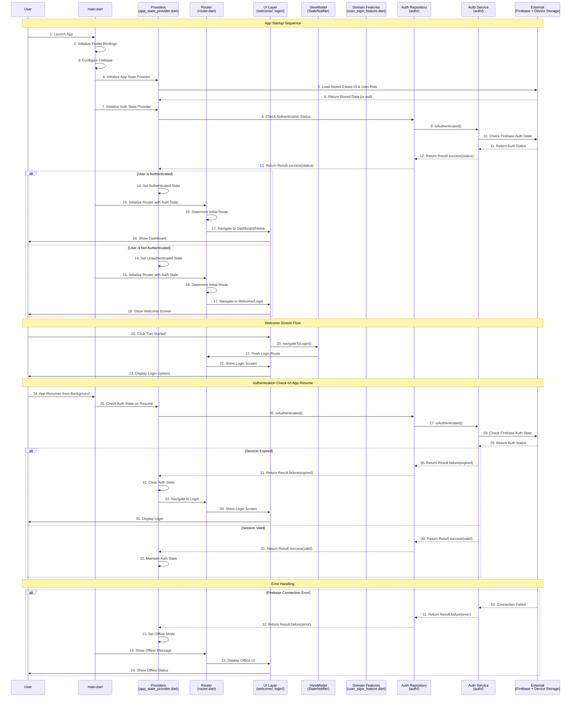

```mermaid
sequenceDiagram
    participant U as User
    participant M as main.dart
    participant P as Providers<br/>(app_state_provider.dart)
    participant R as Router<br/>(router.dart)
    participant UI as UI Layer<br/>(welcome/, login/)
    participant VM as ViewModel<br/>(StateNotifier)
    participant F as Domain Features<br/>(user_sigin_feature.dart)
    participant AR as Auth Repository<br/>(auth/)
    participant AS as Auth Service<br/>(auth/)
    participant E as External<br/>(Firebase + Device Storage)

    Note over U,E: App Startup Sequence
    
    U->>M: 1. Launch App
    M->>M: 2. Initialize Flutter Bindings
    M->>M: 3. Configure Firebase
    M->>P: 4. Initialize App State Provider
    P->>E: 5. Load Stored Estate ID & User Role
    E-->>P: 6. Return Stored Data (or null)
    
    M->>P: 7. Initialize Auth State Provider
    P->>AR: 8. Check Authentication Status
    AR->>AS: 9. isAuthenticated()
    AS->>E: 10. Check Firebase Auth State
    E-->>AS: 11. Return Auth Status
    AS-->>AR: 12. Return Result.success(status)
    AR-->>P: 13. Return Result.success(status)
    
    alt User is Authenticated
        P->>P: 14. Set Authenticated State
        M->>R: 15. Initialize Router with Auth State
        R->>R: 16. Determine Initial Route
        R->>UI: 17. Navigate to Dashboard/Home
        UI->>U: 18. Show Dashboard
        
    else User is Not Authenticated
        P->>P: 14. Set Unauthenticated State
        M->>R: 15. Initialize Router with Auth State
        R->>R: 16. Determine Initial Route
        R->>UI: 17. Navigate to Welcome/Login
        UI->>U: 18. Show Welcome Screen
    end

    Note over U,E: Welcome Screen Flow
    
    U->>UI: 19. Click "Get Started"
    UI->>VM: 20. navigateToLogin()
    VM->>R: 21. Push Login Route
    R->>UI: 22. Show Login Screen
    UI->>U: 23. Display Login Options

    Note over U,E: Authentication Check on App Resume
    
    U->>M: 24. App Resumes from Background
    M->>P: 25. Check Auth State on Resume
    P->>AR: 26. isAuthenticated()
    AR->>AS: 27. isAuthenticated()
    AS->>E: 28. Check Firebase Auth State
    E-->>AS: 29. Return Auth Status
    
    alt Session Expired
        AS-->>AR: 30. Return Result.failure(expired)
        AR-->>P: 31. Return Result.failure(expired)
        P->>P: 32. Clear Auth State
        P->>R: 33. Navigate to Login
        R->>UI: 34. Show Login Screen
        UI->>U: 35. Display Login
    else Session Valid
        AS-->>AR: 30. Return Result.success(valid)
        AR-->>P: 31. Return Result.success(valid)
        P->>P: 32. Maintain Auth State
    end

    Note over U,E: Error Handling
    
    alt Firebase Connection Error
        E-->>AS: 10. Connection Failed
        AS-->>AR: 11. Return Result.failure(error)
        AR-->>P: 12. Return Result.failure(error)
        P->>P: 13. Set Offline Mode
        M->>R: 14. Show Offline Message
        R->>UI: 15. Display Offline UI
        UI->>U: 16. Show Offline Status
    end
``` 