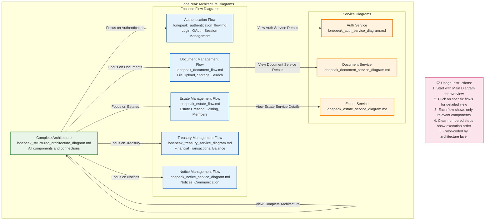

```mermaid
graph TB
    %% Architecture Navigation Guide
    subgraph "LonePeak Architecture Diagrams"
        MainDiagram[Complete Architecture<br/>lonepeak_structured_architecture_diagram.md<br/>All components and connections]
        
        subgraph "Focused Flow Diagrams"
            AuthFlow[Authentication Flow<br/>lonepeak_authentication_flow.md<br/>Login, OAuth, Session Management]
            DocumentFlow[Document Management Flow<br/>lonepeak_document_flow.md<br/>File Upload, Storage, Search]
            EstateFlow[Estate Management Flow<br/>lonepeak_estate_flow.md<br/>Estate Creation, Joining, Members]
            TreasuryFlow[Treasury Management Flow<br/>lonepeak_treasury_service_diagram.md<br/>Financial Transactions, Balance]
            NoticeFlow[Notice Management Flow<br/>lonepeak_notice_service_diagram.md<br/>Notices, Communication]
        end
        
        subgraph "Service Diagrams"
            AuthService[Auth Service<br/>lonepeak_auth_service_diagram.md]
            DocumentService[Document Service<br/>lonepeak_document_service_diagram.md]
            EstateService[Estate Service<br/>lonepeak_estate_service_diagram.md]
        end
    end
    
    %% Navigation Paths
    MainDiagram -->|"View Complete Architecture"| MainDiagram
    MainDiagram -->|"Focus on Authentication"| AuthFlow
    MainDiagram -->|"Focus on Documents"| DocumentFlow
    MainDiagram -->|"Focus on Estates"| EstateFlow
    MainDiagram -->|"Focus on Treasury"| TreasuryFlow
    MainDiagram -->|"Focus on Notices"| NoticeFlow
    
    AuthFlow -->|"View Auth Service Details"| AuthService
    DocumentFlow -->|"View Document Service Details"| DocumentService
    EstateFlow -->|"View Estate Service Details"| EstateService
    
    %% Usage Instructions
    Instructions[📋 Usage Instructions:<br/>1. Start with Main Diagram for overview<br/>2. Click on specific flows for detailed view<br/>3. Each flow shows only relevant components<br/>4. Clear numbered steps show execution order<br/>5. Color-coded by architecture layer]
    
    %% Styling
    classDef main fill:#e8f5e8,stroke:#2e7d32,stroke-width:3px
    classDef flow fill:#e3f2fd,stroke:#1565c0,stroke-width:2px
    classDef service fill:#fff3e0,stroke:#f57c00,stroke-width:2px
    classDef instructions fill:#fce4ec,stroke:#c2185b,stroke-width:2px
    
    class MainDiagram main
    class AuthFlow,DocumentFlow,EstateFlow,TreasuryFlow,NoticeFlow flow
    class AuthService,DocumentService,EstateService service
    class Instructions instructions
``` 