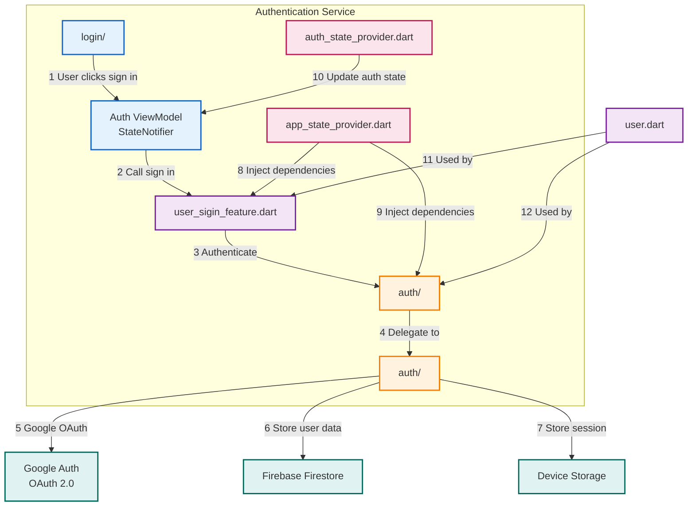

```mermaid
graph TB
    %% Authentication Service Flow
    subgraph "Authentication Service"
        LoginScreen[login/]
        AuthViewModel[Auth ViewModel<br/>StateNotifier]
        UserSignInFeature[user_sigin_feature.dart]
        AuthRepo[auth/]
        AuthService[auth/]
        AppStateProvider[app_state_provider.dart]
        AuthStateProvider[auth_state_provider.dart]
    end
    
    %% Domain Models
    UserModel[user.dart]
    
    %% External Systems
    GoogleAuth[Google Auth<br/>OAuth 2.0]
    Firestore[Firebase Firestore]
    DeviceStorage[Device Storage]
    
    %% Authentication Flow
    LoginScreen -->|1 User clicks sign in| AuthViewModel
    AuthViewModel -->|2 Call sign in| UserSignInFeature
    UserSignInFeature -->|3 Authenticate| AuthRepo
    AuthRepo -->|4 Delegate to| AuthService
    AuthService -->|5 Google OAuth| GoogleAuth
    AuthService -->|6 Store user data| Firestore
    AuthService -->|7 Store session| DeviceStorage
    
    %% State Management
    AppStateProvider -->|8 Inject dependencies| UserSignInFeature
    AppStateProvider -->|9 Inject dependencies| AuthRepo
    AuthStateProvider -->|10 Update auth state| AuthViewModel
    
    %% Domain Models
    UserModel -->|11 Used by| UserSignInFeature
    UserModel -->|12 Used by| AuthRepo
    
    %% Styling
    classDef ui fill:#e3f2fd,stroke:#1565c0,stroke-width:2px
    classDef domain fill:#f3e5f5,stroke:#7b1fa2,stroke-width:2px
    classDef data fill:#fff3e0,stroke:#f57c00,stroke-width:2px
    classDef infrastructure fill:#fce4ec,stroke:#c2185b,stroke-width:2px
    classDef external fill:#e0f2f1,stroke:#00695c,stroke-width:2px
    
    class LoginScreen,AuthViewModel ui
    class UserSignInFeature,UserModel domain
    class AuthRepo,AuthService data
    class AppStateProvider,AuthStateProvider infrastructure
    class GoogleAuth,Firestore,DeviceStorage external
``` 