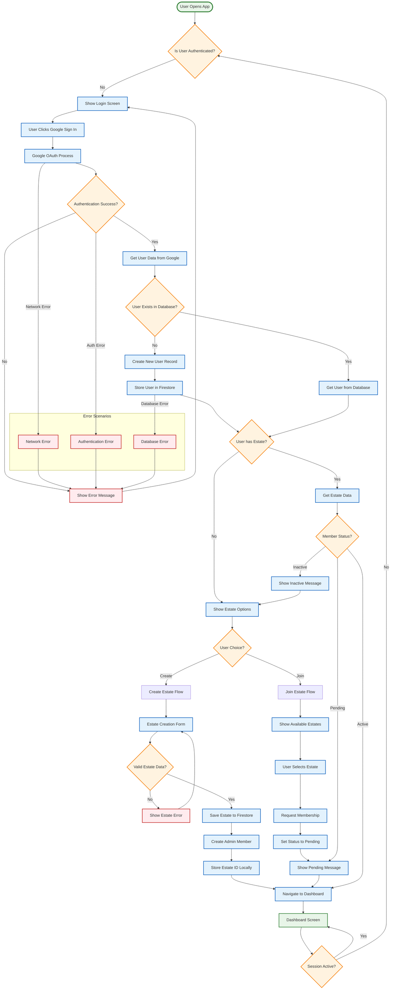

```mermaid
flowchart TD
    %% Detailed Authentication Flow
    Start([User Opens App]) --> CheckAuth{Is User Authenticated?}
    
    CheckAuth -->|No| ShowLogin[Show Login Screen]
    ShowLogin --> GoogleButton[User Clicks Google Sign In]
    GoogleButton --> GoogleAuth[Google OAuth Process]
    
    GoogleAuth --> AuthSuccess{Authentication Success?}
    AuthSuccess -->|No| ShowError[Show Error Message]
    ShowError --> ShowLogin
    
    AuthSuccess -->|Yes| GetUserData[Get User Data from Google]
    GetUserData --> CheckUserExists{User Exists in Database?}
    
    CheckUserExists -->|No| CreateUser[Create New User Record]
    CreateUser --> StoreUser[Store User in Firestore]
    StoreUser --> CheckEstate{User has Estate?}
    
    CheckUserExists -->|Yes| GetStoredUser[Get User from Database]
    GetStoredUser --> CheckEstate
    
    CheckEstate -->|No| ShowEstateOptions[Show Estate Options]
    ShowEstateOptions --> EstateChoice{User Choice?}
    
    EstateChoice -->|Create| CreateEstateFlow[Create Estate Flow]
    EstateChoice -->|Join| JoinEstateFlow[Join Estate Flow]
    
    CreateEstateFlow --> EstateForm[Estate Creation Form]
    EstateForm --> ValidateEstate{Valid Estate Data?}
    ValidateEstate -->|No| EstateError[Show Estate Error]
    EstateError --> EstateForm
    
    ValidateEstate -->|Yes| SaveEstate[Save Estate to Firestore]
    SaveEstate --> CreateAdmin[Create Admin Member]
    CreateAdmin --> StoreEstateId[Store Estate ID Locally]
    StoreEstateId --> NavigateDashboard[Navigate to Dashboard]
    
    JoinEstateFlow --> EstateList[Show Available Estates]
    EstateList --> SelectEstate[User Selects Estate]
    SelectEstate --> RequestMembership[Request Membership]
    RequestMembership --> PendingStatus[Set Status to Pending]
    PendingStatus --> ShowPending[Show Pending Message]
    ShowPending --> NavigateDashboard
    
    CheckEstate -->|Yes| GetEstateData[Get Estate Data]
    GetEstateData --> CheckMemberStatus{Member Status?}
    
    CheckMemberStatus -->|Active| NavigateDashboard
    CheckMemberStatus -->|Pending| ShowPending
    CheckMemberStatus -->|Inactive| ShowInactive[Show Inactive Message]
    ShowInactive --> ShowEstateOptions
    
    NavigateDashboard --> Dashboard[Dashboard Screen]
    Dashboard --> SessionActive{Session Active?}
    SessionActive -->|Yes| Dashboard
    SessionActive -->|No| CheckAuth
    
    %% Error Handling
    subgraph "Error Scenarios"
        NetworkError[Network Error]
        AuthError[Authentication Error]
        DatabaseError[Database Error]
    end
    
    GoogleAuth -->|Network Error| NetworkError
    NetworkError --> ShowError
    
    AuthSuccess -->|Auth Error| AuthError
    AuthError --> ShowError
    
    StoreUser -->|Database Error| DatabaseError
    DatabaseError --> ShowError
    
    %% Styling
    classDef startEnd fill:#e8f5e8,stroke:#2e7d32,stroke-width:3px
    classDef process fill:#e3f2fd,stroke:#1565c0,stroke-width:2px
    classDef decision fill:#fff3e0,stroke:#f57c00,stroke-width:2px
    classDef error fill:#ffebee,stroke:#c62828,stroke-width:2px
    classDef success fill:#e8f5e8,stroke:#2e7d32,stroke-width:2px
    
    class Start,Dashboard startEnd
    class ShowLogin,GoogleButton,GoogleAuth,GetUserData,CreateUser,StoreUser,GetStoredUser,ShowEstateOptions,EstateForm,SaveEstate,CreateAdmin,StoreEstateId,NavigateDashboard,EstateList,SelectEstate,RequestMembership,PendingStatus,ShowPending,GetEstateData,ShowInactive process
    class CheckAuth,AuthSuccess,CheckUserExists,CheckEstate,EstateChoice,ValidateEstate,CheckMemberStatus,SessionActive decision
    class ShowError,EstateError,NetworkError,AuthError,DatabaseError error
    class Dashboard success
``` 