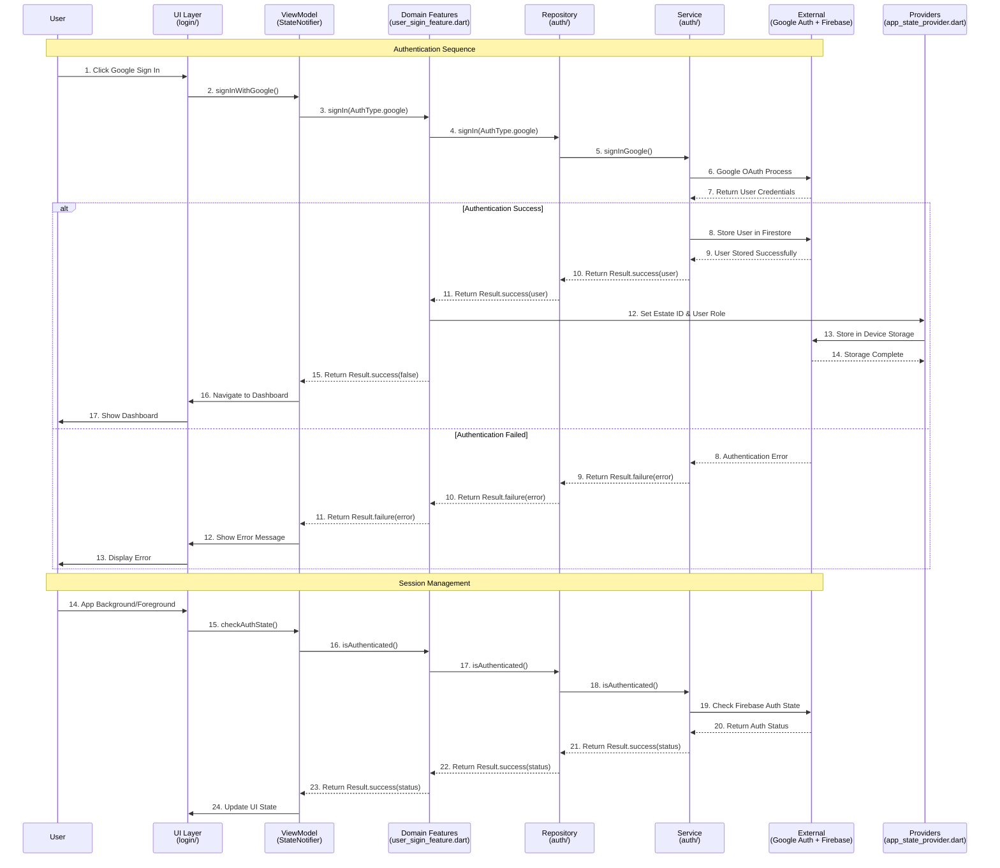

```mermaid
sequenceDiagram
    participant U as User
    participant UI as UI Layer<br/>(login/)
    participant VM as ViewModel<br/>(StateNotifier)
    participant F as Domain Features<br/>(user_sigin_feature.dart)
    participant R as Repository<br/>(auth/)
    participant S as Service<br/>(auth/)
    participant E as External<br/>(Google Auth + Firebase)
    participant P as Providers<br/>(app_state_provider.dart)

    Note over U,E: Authentication Sequence
    
    U->>UI: 1. Click Google Sign In
    UI->>VM: 2. signInWithGoogle()
    VM->>F: 3. signIn(AuthType.google)
    
    F->>R: 4. signIn(AuthType.google)
    R->>S: 5. signInGoogle()
    S->>E: 6. Google OAuth Process
    E-->>S: 7. Return User Credentials
    
    alt Authentication Success
        S->>E: 8. Store User in Firestore
        E-->>S: 9. User Stored Successfully
        S-->>R: 10. Return Result.success(user)
        R-->>F: 11. Return Result.success(user)
        
        F->>P: 12. Set Estate ID & User Role
        P->>E: 13. Store in Device Storage
        E-->>P: 14. Storage Complete
        
        F-->>VM: 15. Return Result.success(false)
        VM->>UI: 16. Navigate to Dashboard
        UI->>U: 17. Show Dashboard
        
    else Authentication Failed
        E-->>S: 8. Authentication Error
        S-->>R: 9. Return Result.failure(error)
        R-->>F: 10. Return Result.failure(error)
        F-->>VM: 11. Return Result.failure(error)
        VM->>UI: 12. Show Error Message
        UI->>U: 13. Display Error
    end

    Note over U,E: Session Management
    
    U->>UI: 14. App Background/Foreground
    UI->>VM: 15. checkAuthState()
    VM->>F: 16. isAuthenticated()
    F->>R: 17. isAuthenticated()
    R->>S: 18. isAuthenticated()
    S->>E: 19. Check Firebase Auth State
    E-->>S: 20. Return Auth Status
    S-->>R: 21. Return Result.success(status)
    R-->>F: 22. Return Result.success(status)
    F-->>VM: 23. Return Result.success(status)
    VM->>UI: 24. Update UI State
``` 