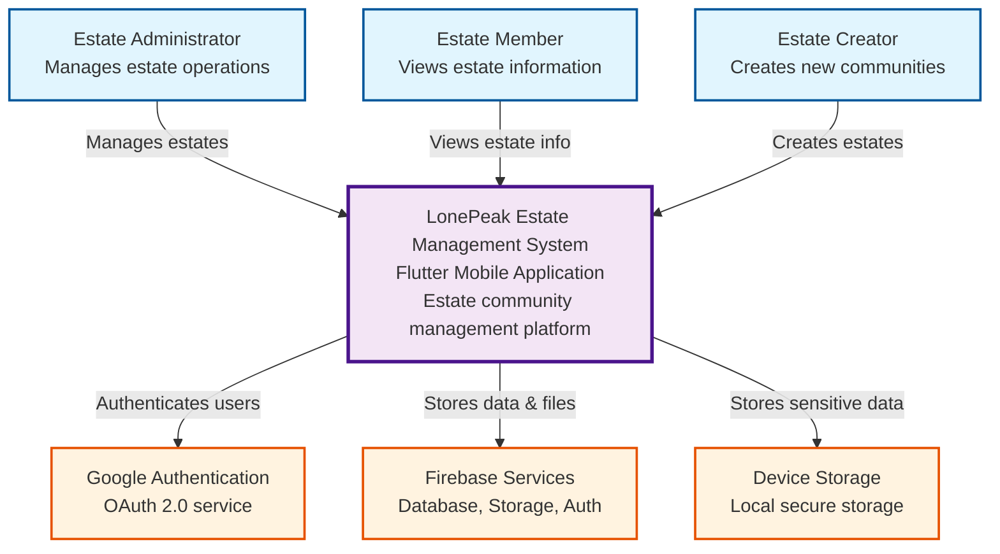

```mermaid
graph TB
    %% Actors
    Admin[Estate Administrator<br/>Manages estate operations]
    Member[Estate Member<br/>Views estate information]
    Creator[Estate Creator<br/>Creates new communities]
    
    %% Main System
    LonePeak[LonePeak Estate Management System<br/>Flutter Mobile Application<br/>Estate community management platform]
    
    %% External Systems
    Google[Google Authentication<br/>OAuth 2.0 service]
    Firebase[Firebase Services<br/>Database, Storage, Auth]
    Device[Device Storage<br/>Local secure storage]
    
    %% Relationships - Users to System
    Admin -->|Manages estates| LonePeak
    Member -->|Views estate info| LonePeak
    Creator -->|Creates estates| LonePeak
    
    %% Relationships - System to External
    LonePeak -->|Authenticates users| Google
    LonePeak -->|Stores data & files| Firebase
    LonePeak -->|Stores sensitive data| Device
    
    %% Styling
    classDef actor fill:#e1f5fe,stroke:#01579b,stroke-width:2px
    classDef system fill:#f3e5f5,stroke:#4a148c,stroke-width:3px
    classDef external fill:#fff3e0,stroke:#e65100,stroke-width:2px
    
    class Admin,Member,Creator actor
    class LonePeak system
    class Google,Firebase,Device external
``` 