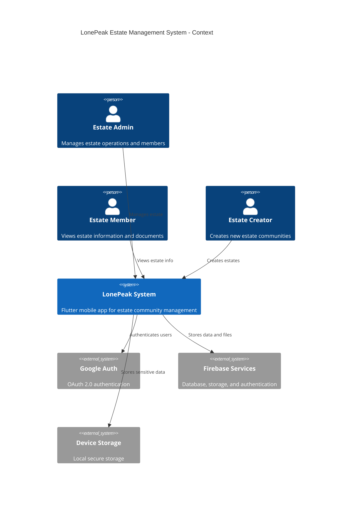

```mermaid
C4Context
    title LonePeak Estate Management System - Context

    Person(admin, "Estate Admin", "Manages estate operations and members")
    Person(member, "Estate Member", "Views estate information and documents")
    Person(creator, "Estate Creator", "Creates new estate communities")

    System(lonepeak, "LonePeak System", "Flutter mobile app for estate community management")

    System_Ext(google, "Google Auth", "OAuth 2.0 authentication")
    System_Ext(firebase, "Firebase Services", "Database, storage, and authentication")
    System_Ext(device, "Device Storage", "Local secure storage")

    Rel(admin, lonepeak, "Manages estate")
    Rel(member, lonepeak, "Views estate info")
    Rel(creator, lonepeak, "Creates estates")

    Rel(lonepeak, google, "Authenticates users")
    Rel(lonepeak, firebase, "Stores data and files")
    Rel(lonepeak, device, "Stores sensitive data")

    UpdateLayoutConfig($c4ShapeInRow="3", $c4BoundaryInRow="1")
``` 