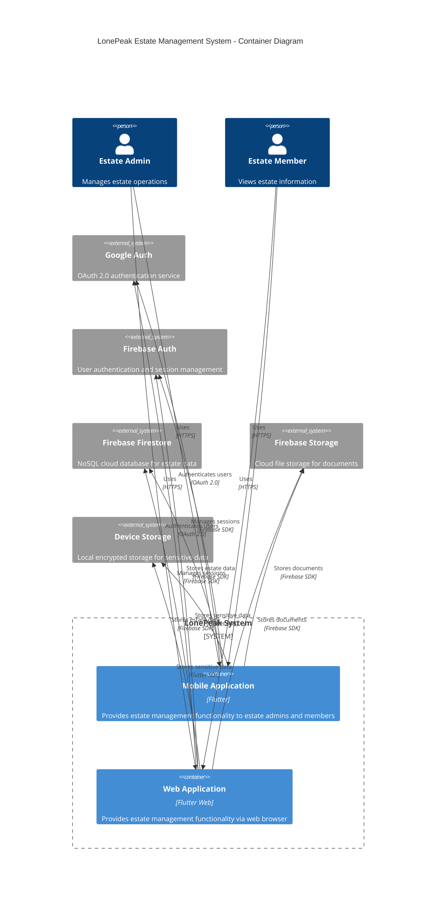

```mermaid
C4Container
    title LonePeak Estate Management System - Container Diagram

    Person(admin, "Estate Admin", "Manages estate operations")
    Person(member, "Estate Member", "Views estate information")

    System_Boundary(c1, "LonePeak System") {
        Container(mobileApp, "Mobile Application", "Flutter", "Provides estate management functionality to estate admins and members")
        Container(webApp, "Web Application", "Flutter Web", "Provides estate management functionality via web browser")
    }

    System_Ext(googleAuth, "Google Auth", "OAuth 2.0 authentication service")
    System_Ext(firebaseAuth, "Firebase Auth", "User authentication and session management")
    System_Ext(firebaseFirestore, "Firebase Firestore", "NoSQL cloud database for estate data")
    System_Ext(firebaseStorage, "Firebase Storage", "Cloud file storage for documents")
    System_Ext(deviceStorage, "Device Storage", "Local encrypted storage for sensitive data")

    Rel(admin, mobileApp, "Uses", "HTTPS")
    Rel(admin, webApp, "Uses", "HTTPS")
    Rel(member, mobileApp, "Uses", "HTTPS")
    Rel(member, webApp, "Uses", "HTTPS")

    Rel(mobileApp, googleAuth, "Authenticates users", "OAuth 2.0")
    Rel(webApp, googleAuth, "Authenticates users", "OAuth 2.0")
    Rel(mobileApp, firebaseAuth, "Manages sessions", "Firebase SDK")
    Rel(webApp, firebaseAuth, "Manages sessions", "Firebase SDK")
    Rel(mobileApp, firebaseFirestore, "Stores estate data", "Firebase SDK")
    Rel(webApp, firebaseFirestore, "Stores estate data", "Firebase SDK")
    Rel(mobileApp, firebaseStorage, "Stores documents", "Firebase SDK")
    Rel(webApp, firebaseStorage, "Stores documents", "Firebase SDK")
    Rel(mobileApp, deviceStorage, "Stores sensitive data", "Flutter SDK")
    Rel(webApp, deviceStorage, "Stores sensitive data", "Flutter SDK")

    UpdateLayoutConfig($c4ShapeInRow="3", $c4BoundaryInRow="1")
``` 