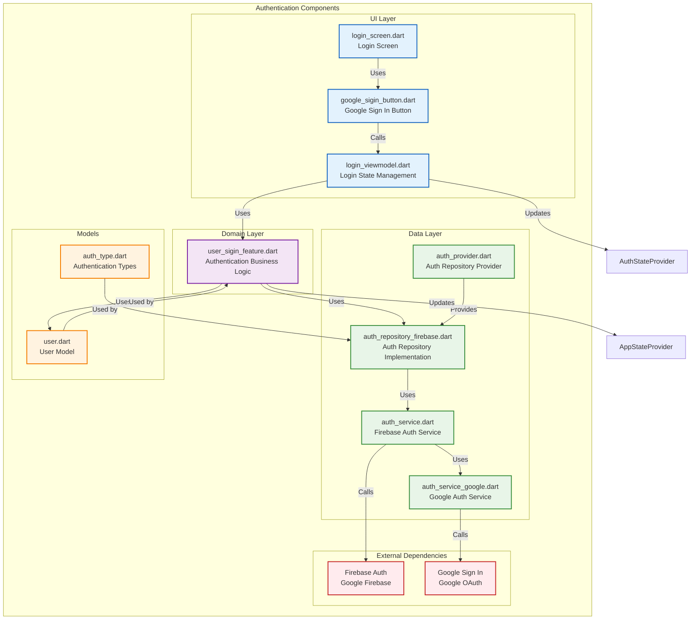

```mermaid
graph TB
    subgraph "Authentication Components"
        subgraph "UI Layer"
            LoginScreen[login_screen.dart<br/>Login Screen]
            GoogleSignInButton[google_sigin_button.dart<br/>Google Sign In Button]
            LoginViewModel[login_viewmodel.dart<br/>Login State Management]
        end
        
        subgraph "Domain Layer"
            UserSignInFeature[user_sigin_feature.dart<br/>Authentication Business Logic]
        end
        
        subgraph "Data Layer"
            AuthRepository[auth_repository_firebase.dart<br/>Auth Repository Implementation]
            AuthProvider[auth_provider.dart<br/>Auth Repository Provider]
            AuthService[auth_service.dart<br/>Firebase Auth Service]
            AuthServiceGoogle[auth_service_google.dart<br/>Google Auth Service]
        end
        
        subgraph "Models"
            AuthType[auth_type.dart<br/>Authentication Types]
            User[user.dart<br/>User Model]
        end
        
        subgraph "External Dependencies"
            FirebaseAuth[Firebase Auth<br/>Google Firebase]
            GoogleSignIn[Google Sign In<br/>Google OAuth]
        end
    end
    
    %% UI Flow
    LoginScreen -->|Uses| GoogleSignInButton
    GoogleSignInButton -->|Calls| LoginViewModel
    LoginViewModel -->|Uses| UserSignInFeature
    
    %% Domain Layer
    UserSignInFeature -->|Uses| AuthRepository
    UserSignInFeature -->|Uses| User
    
    %% Data Layer
    AuthRepository -->|Uses| AuthService
    AuthService -->|Uses| AuthServiceGoogle
    AuthProvider -->|Provides| AuthRepository
    
    %% External Dependencies
    AuthService -->|Calls| FirebaseAuth
    AuthServiceGoogle -->|Calls| GoogleSignIn
    
    %% Model Usage
    AuthType -->|Used by| AuthRepository
    User -->|Used by| UserSignInFeature
    
    %% State Management Integration
    LoginViewModel -->|Updates| AuthStateProvider
    UserSignInFeature -->|Updates| AppStateProvider
    
    %% Styling
    classDef ui fill:#e3f2fd,stroke:#1565c0,stroke-width:2px
    classDef domain fill:#f3e5f5,stroke:#7b1fa2,stroke-width:2px
    classDef data fill:#e8f5e8,stroke:#388e3c,stroke-width:2px
    classDef model fill:#fff3e0,stroke:#f57c00,stroke-width:2px
    classDef external fill:#ffebee,stroke:#c62828,stroke-width:2px
    
    class LoginScreen,GoogleSignInButton,LoginViewModel ui
    class UserSignInFeature domain
    class AuthRepository,AuthProvider,AuthService,AuthServiceGoogle data
    class AuthType,User model
    class FirebaseAuth,GoogleSignIn external
``` 