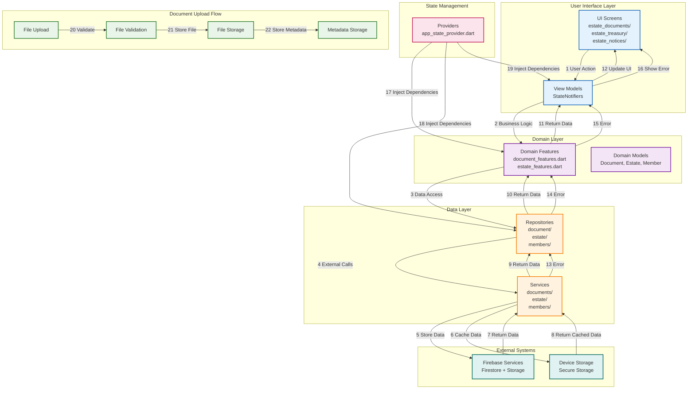

```mermaid
flowchart TD
    %% Data Flow Diagram
    subgraph "User Interface Layer"
        UI[UI Screens<br/>estate_documents/<br/>estate_treasury/<br/>estate_notices/]
        ViewModels[View Models<br/>StateNotifiers]
    end
    
    subgraph "Domain Layer"
        Features[Domain Features<br/>document_features.dart<br/>estate_features.dart]
        Models[Domain Models<br/>Document, Estate, Member]
    end
    
    subgraph "Data Layer"
        Repositories[Repositories<br/>document/<br/>estate/<br/>members/]
        Services[Services<br/>documents/<br/>estate/<br/>members/]
    end
    
    subgraph "External Systems"
        Firebase[Firebase Services<br/>Firestore + Storage]
        Device[Device Storage<br/>Secure Storage]
    end
    
    %% Data Flow Paths
    UI -->|1 User Action| ViewModels
    ViewModels -->|2 Business Logic| Features
    Features -->|3 Data Access| Repositories
    Repositories -->|4 External Calls| Services
    Services -->|5 Store Data| Firebase
    Services -->|6 Cache Data| Device
    
    %% Data Return Path
    Firebase -->|7 Return Data| Services
    Device -->|8 Return Cached Data| Services
    Services -->|9 Return Data| Repositories
    Repositories -->|10 Return Data| Features
    Features -->|11 Return Data| ViewModels
    ViewModels -->|12 Update UI| UI
    
    %% Error Flow
    Services -->|13 Error| Repositories
    Repositories -->|14 Error| Features
    Features -->|15 Error| ViewModels
    ViewModels -->|16 Show Error| UI
    
    %% State Management Flow
    subgraph "State Management"
        Providers[Providers<br/>app_state_provider.dart]
    end
    
    Providers -->|17 Inject Dependencies| Features
    Providers -->|18 Inject Dependencies| Repositories
    Providers -->|19 Inject Dependencies| ViewModels
    
    %% Specific Data Flows
    subgraph "Document Upload Flow"
        FileUpload[File Upload]
        FileValidation[File Validation]
        FileStorage[File Storage]
        MetadataStorage[Metadata Storage]
    end
    
    FileUpload -->|20 Validate| FileValidation
    FileValidation -->|21 Store File| FileStorage
    FileStorage -->|22 Store Metadata| MetadataStorage
    
    %% Styling
    classDef ui fill:#e3f2fd,stroke:#1565c0,stroke-width:2px
    classDef domain fill:#f3e5f5,stroke:#7b1fa2,stroke-width:2px
    classDef data fill:#fff3e0,stroke:#f57c00,stroke-width:2px
    classDef external fill:#e0f2f1,stroke:#00695c,stroke-width:2px
    classDef state fill:#fce4ec,stroke:#c2185b,stroke-width:2px
    classDef flow fill:#e8f5e8,stroke:#2e7d32,stroke-width:2px
    
    class UI,ViewModels ui
    class Features,Models domain
    class Repositories,Services data
    class Firebase,Device external
    class Providers state
    class FileUpload,FileValidation,FileStorage,MetadataStorage flow
``` 