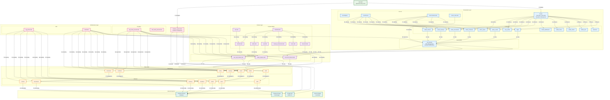

```mermaid
graph TB
    %% Main Application Entry
    Main[main.dart<br/>Application Entry Point]
    
    %% Presentation Layer (UI)
    subgraph "Presentation Layer"
        Router[Router<br/>router.dart, routes.dart<br/>Navigation Management]
        
        subgraph "UI Screens"
            Login[login/]
            Welcome[welcome/]
            EstateCreate[estate_create/]
            EstateJoin[estate_join/]
            EstateSelect[estate_select/]
            EstateHome[estate_home/]
            EstateDashboard[estate_dashboard/]
            EstateMembers[estate_members/]
            EstateDocuments[estate_documents/]
            EstateTreasury[estate_treasury/]
            EstateNotices[estate_notices/]
            UserProfile[user_profile/]
            AdminPanel[admin_panel/]
        end
        
        subgraph "Core UI"
            CoreWidgets[core/widgets/]
            CoreThemes[core/themes/]
            CoreConstants[core/constants.dart]
            CoreUIState[core/ui_state.dart]
        end
        
        subgraph "View Models"
            ViewModels[View Models<br/>State Management<br/>Riverpod StateNotifiers]
        end
    end
    
    %% Domain Layer
    subgraph "Domain Layer"
        subgraph "Domain Models"
            DocumentModel[document.dart]
            NoticeModel[notice.dart]
            RoleModel[role.dart]
            TreasuryModel[treasury_transaction.dart]
            UserModel[user.dart]
            EstateModel[estate.dart]
            MemberModel[member.dart]
            MetadataModel[metadata.dart]
        end
        
        subgraph "Domain Features"
            DocumentFeatures[document_features.dart]
            EstateFeatures[estate_features.dart]
            UserSignInFeature[user_sigin_feature.dart]
        end
    end
    
    %% Data Layer
    subgraph "Data Layer"
        subgraph "Repositories"
            AuthRepo[auth/]
            UsersRepo[users/]
            EstateRepo[estate/]
            MembersRepo[members/]
            DocumentsRepo[document/]
            TreasuryRepo[treasury/]
            NoticeRepo[notice/]
        end
        
        subgraph "Services"
            AuthService[auth/]
            UsersService[users/]
            EstateService[estate/]
            MembersService[members/]
            DocumentsService[documents/]
            TreasuryService[treasury/]
            NoticeService[notices/]
        end
    end
    
    %% Infrastructure Layer
    subgraph "Infrastructure Layer"
        subgraph "Providers"
            AppStateProvider[app_state_provider.dart]
            AuthStateProvider[auth_state_provider.dart]
        end
        
        subgraph "Utils"
            LogPrinter[log_printer.dart]
            Result[result.dart]
        end
        
        FirebaseConfig[firebase_options.dart<br/>Firebase Configuration]
    end
    
    %% External Systems
    subgraph "External Systems"
        GoogleAuth[Google Auth<br/>OAuth 2.0]
        Firestore[Firebase Firestore<br/>Database]
        Storage[Firebase Storage<br/>File Storage]
        DeviceStorage[Device Storage<br/>Local Data]
    end
    
    %% Relationships - Application Startup Flow
    Main -->|1. Initialize| Router
    Main -->|2. Configure| FirebaseConfig
    FirebaseConfig -->|3. Connect| GoogleAuth
    FirebaseConfig -->|4. Connect| Firestore
    FirebaseConfig -->|5. Connect| Storage
    
    %% Relationships - Navigation Flow
    Router -->|6. Route to| Login
    Router -->|7. Route to| Welcome
    Router -->|8. Route to| EstateCreate
    Router -->|9. Route to| EstateJoin
    Router -->|10. Route to| EstateSelect
    Router -->|11. Route to| EstateHome
    Router -->|12. Route to| EstateDashboard
    Router -->|13. Route to| EstateMembers
    Router -->|14. Route to| EstateDocuments
    Router -->|15. Route to| EstateTreasury
    Router -->|16. Route to| EstateNotices
    Router -->|17. Route to| UserProfile
    Router -->|18. Route to| AdminPanel
    
    %% Relationships - UI to View Models
    Login -->|19. Use| ViewModels
    EstateCreate -->|20. Use| ViewModels
    EstateMembers -->|21. Use| ViewModels
    EstateDocuments -->|22. Use| ViewModels
    EstateTreasury -->|23. Use| ViewModels
    EstateNotices -->|24. Use| ViewModels
    
    %% Relationships - View Models to Features
    ViewModels -->|25. Call| DocumentFeatures
    ViewModels -->|26. Call| EstateFeatures
    ViewModels -->|27. Call| UserSignInFeature
    
    %% Relationships - Features to Repositories
    DocumentFeatures -->|28. Use| DocumentsRepo
    EstateFeatures -->|29. Use| EstateRepo
    EstateFeatures -->|30. Use| MembersRepo
    UserSignInFeature -->|31. Use| AuthRepo
    UserSignInFeature -->|32. Use| UsersRepo
    
    %% Relationships - Repositories to Services
    AuthRepo -->|33. Delegate to| AuthService
    UsersRepo -->|34. Delegate to| UsersService
    EstateRepo -->|35. Delegate to| EstateService
    MembersRepo -->|36. Delegate to| MembersService
    DocumentsRepo -->|37. Delegate to| DocumentsService
    TreasuryRepo -->|38. Delegate to| TreasuryService
    NoticeRepo -->|39. Delegate to| NoticeService
    
    %% Relationships - Services to External
    AuthService -->|40. Authenticate| GoogleAuth
    UsersService -->|41. Store data| Firestore
    EstateService -->|42. Store data| Firestore
    MembersService -->|43. Store data| Firestore
    DocumentsService -->|44. Store data| Firestore
    DocumentsService -->|45. Store files| Storage
    TreasuryService -->|46. Store data| Firestore
    NoticeService -->|47. Store data| Firestore
    
    %% Relationships - Providers to Components
    AppStateProvider -->|48. Inject into| ViewModels
    AppStateProvider -->|49. Inject into| DocumentFeatures
    AppStateProvider -->|50. Inject into| EstateFeatures
    AppStateProvider -->|51. Inject into| UserSignInFeature
    AppStateProvider -->|52. Inject into| AuthRepo
    AppStateProvider -->|53. Inject into| UsersRepo
    AppStateProvider -->|54. Inject into| EstateRepo
    AppStateProvider -->|55. Inject into| MembersRepo
    AppStateProvider -->|56. Inject into| DocumentsRepo
    
    %% Relationships - Utils to Components
    Result -->|57. Used by| DocumentFeatures
    Result -->|58. Used by| EstateFeatures
    Result -->|59. Used by| UserSignInFeature
    Result -->|60. Used by| AuthRepo
    Result -->|61. Used by| UsersRepo
    Result -->|62. Used by| EstateRepo
    Result -->|63. Used by| MembersRepo
    Result -->|64. Used by| DocumentsRepo
    Result -->|65. Used by| TreasuryRepo
    Result -->|66. Used by| NoticeRepo
    
    LogPrinter -->|67. Used by| AuthService
    LogPrinter -->|68. Used by| UsersService
    LogPrinter -->|69. Used by| EstateService
    LogPrinter -->|70. Used by| MembersService
    LogPrinter -->|71. Used by| DocumentsService
    LogPrinter -->|72. Used by| TreasuryService
    LogPrinter -->|73. Used by| NoticeService
    
    %% Relationships - Core UI Components
    CoreConstants -->|74. Used by| Login
    CoreConstants -->|75. Used by| EstateCreate
    CoreConstants -->|76. Used by| EstateMembers
    CoreConstants -->|77. Used by| EstateDocuments
    CoreConstants -->|78. Used by| EstateTreasury
    CoreConstants -->|79. Used by| EstateNotices
    
    CoreUIState -->|80. Used by| ViewModels
    CoreThemes -->|81. Used by| Login
    CoreThemes -->|82. Used by| EstateCreate
    CoreThemes -->|83. Used by| EstateMembers
    CoreThemes -->|84. Used by| EstateDocuments
    CoreThemes -->|85. Used by| EstateTreasury
    CoreThemes -->|86. Used by| EstateNotices
    
    %% Relationships - Domain Models
    DocumentModel -->|87. Used by| DocumentFeatures
    NoticeModel -->|88. Used by| NoticeRepo
    RoleModel -->|89. Used by| MemberModel
    TreasuryModel -->|90. Used by| TreasuryRepo
    UserModel -->|91. Used by| UserSignInFeature
    EstateModel -->|92. Used by| EstateFeatures
    MemberModel -->|93. Used by| EstateFeatures
    MetadataModel -->|94. Used by| DocumentModel
    MetadataModel -->|95. Used by| NoticeModel
    MetadataModel -->|96. Used by| TreasuryModel
    MetadataModel -->|97. Used by| UserModel
    MetadataModel -->|98. Used by| EstateModel
    MetadataModel -->|99. Used by| MemberModel
    
    %% Styling
    classDef entry fill:#e8f5e8,stroke:#2e7d32,stroke-width:3px
    classDef presentation fill:#e3f2fd,stroke:#1565c0,stroke-width:2px
    classDef domain fill:#f3e5f5,stroke:#7b1fa2,stroke-width:2px
    classDef data fill:#fff3e0,stroke:#f57c00,stroke-width:2px
    classDef infrastructure fill:#fce4ec,stroke:#c2185b,stroke-width:2px
    classDef external fill:#e0f2f1,stroke:#00695c,stroke-width:2px
    
    class Main entry
    class Router,Login,Welcome,EstateCreate,EstateJoin,EstateSelect,EstateHome,EstateDashboard,EstateMembers,EstateDocuments,EstateTreasury,EstateNotices,UserProfile,AdminPanel,CoreWidgets,CoreThemes,CoreConstants,CoreUIState,ViewModels presentation
    class DocumentModel,NoticeModel,RoleModel,TreasuryModel,UserModel,EstateModel,MemberModel,MetadataModel,DocumentFeatures,EstateFeatures,UserSignInFeature domain
    class AuthRepo,UsersRepo,EstateRepo,MembersRepo,DocumentsRepo,TreasuryRepo,NoticeRepo,AuthService,UsersService,EstateService,MembersService,DocumentsService,TreasuryService,NoticeService data
    class AppStateProvider,AuthStateProvider,LogPrinter,Result,FirebaseConfig infrastructure
    class GoogleAuth,Firestore,Storage,DeviceStorage external
``` 