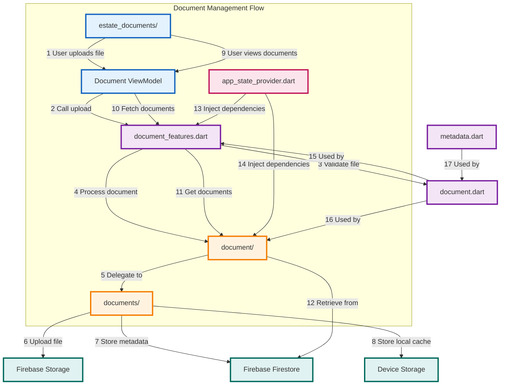

```mermaid
graph TB
    %% Document Management Flow Only
    subgraph "Document Management Flow"
        DocumentScreen[estate_documents/]
        DocumentViewModel[Document ViewModel]
        DocumentFeatures[document_features.dart]
        DocumentsRepo[document/]
        DocumentsService[documents/]
        AppStateProvider[app_state_provider.dart]
    end
    
    %% Domain Models
    DocumentModel[document.dart]
    MetadataModel[metadata.dart]
    
    %% External Systems
    Firestore[Firebase Firestore]
    Storage[Firebase Storage]
    DeviceStorage[Device Storage]
    
    %% Document Upload Flow - Clear Path
    DocumentScreen -->|1 User uploads file| DocumentViewModel
    DocumentViewModel -->|2 Call upload| DocumentFeatures
    DocumentFeatures -->|3 Validate file| DocumentModel
    DocumentFeatures -->|4 Process document| DocumentsRepo
    DocumentsRepo -->|5 Delegate to| DocumentsService
    DocumentsService -->|6 Upload file| Storage
    DocumentsService -->|7 Store metadata| Firestore
    DocumentsService -->|8 Store local cache| DeviceStorage
    
    %% Document View Flow
    DocumentScreen -->|9 User views documents| DocumentViewModel
    DocumentViewModel -->|10 Fetch documents| DocumentFeatures
    DocumentFeatures -->|11 Get documents| DocumentsRepo
    DocumentsRepo -->|12 Retrieve from| Firestore
    
    %% State Management
    AppStateProvider -->|13 Inject dependencies| DocumentFeatures
    AppStateProvider -->|14 Inject dependencies| DocumentsRepo
    
    %% Domain Models
    DocumentModel -->|15 Used by| DocumentFeatures
    DocumentModel -->|16 Used by| DocumentsRepo
    MetadataModel -->|17 Used by| DocumentModel
    
    %% Styling
    classDef ui fill:#e3f2fd,stroke:#1565c0,stroke-width:3px
    classDef domain fill:#f3e5f5,stroke:#7b1fa2,stroke-width:3px
    classDef data fill:#fff3e0,stroke:#f57c00,stroke-width:3px
    classDef infrastructure fill:#fce4ec,stroke:#c2185b,stroke-width:3px
    classDef external fill:#e0f2f1,stroke:#00695c,stroke-width:3px
    
    class DocumentScreen,DocumentViewModel ui
    class DocumentFeatures,DocumentModel,MetadataModel domain
    class DocumentsRepo,DocumentsService data
    class AppStateProvider infrastructure
    class Firestore,Storage,DeviceStorage external
``` 