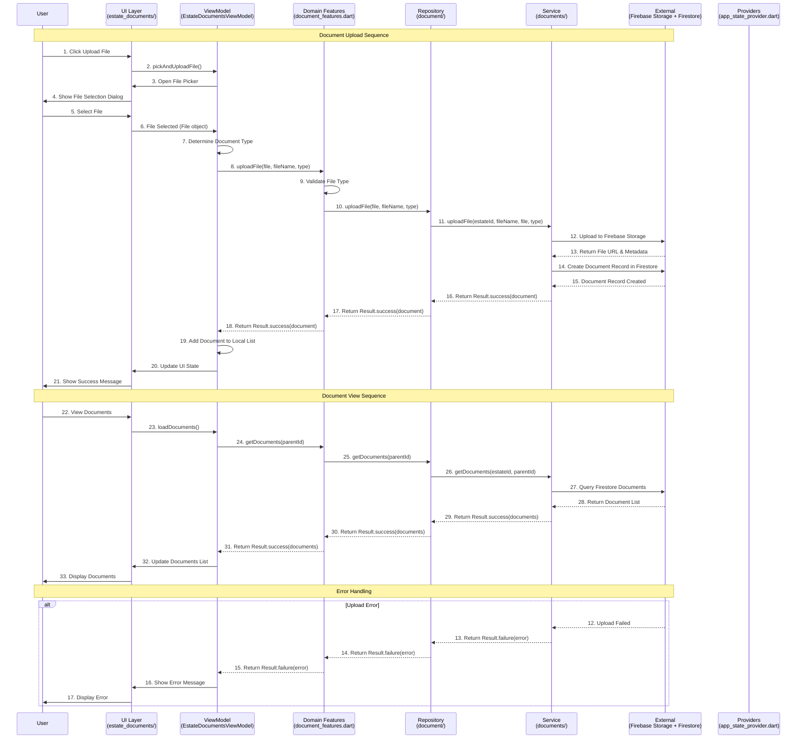

```mermaid
sequenceDiagram
    participant U as User
    participant UI as UI Layer<br/>(estate_documents/)
    participant VM as ViewModel<br/>(EstateDocumentsViewModel)
    participant F as Domain Features<br/>(document_features.dart)
    participant R as Repository<br/>(document/)
    participant S as Service<br/>(documents/)
    participant E as External<br/>(Firebase Storage + Firestore)
    participant P as Providers<br/>(app_state_provider.dart)

    Note over U,E: Document Upload Sequence
    
    U->>UI: 1. Click Upload File
    UI->>VM: 2. pickAndUploadFile()
    VM->>UI: 3. Open File Picker
    UI->>U: 4. Show File Selection Dialog
    
    U->>UI: 5. Select File
    UI->>VM: 6. File Selected (File object)
    VM->>VM: 7. Determine Document Type
    VM->>F: 8. uploadFile(file, fileName, type)
    
    F->>F: 9. Validate File Type
    F->>R: 10. uploadFile(file, fileName, type)
    R->>S: 11. uploadFile(estateId, fileName, file, type)
    
    S->>E: 12. Upload to Firebase Storage
    E-->>S: 13. Return File URL & Metadata
    
    S->>E: 14. Create Document Record in Firestore
    E-->>S: 15. Document Record Created
    
    S-->>R: 16. Return Result.success(document)
    R-->>F: 17. Return Result.success(document)
    F-->>VM: 18. Return Result.success(document)
    
    VM->>VM: 19. Add Document to Local List
    VM->>UI: 20. Update UI State
    UI->>U: 21. Show Success Message
    
    Note over U,E: Document View Sequence
    
    U->>UI: 22. View Documents
    UI->>VM: 23. loadDocuments()
    VM->>F: 24. getDocuments(parentId)
    F->>R: 25. getDocuments(parentId)
    R->>S: 26. getDocuments(estateId, parentId)
    S->>E: 27. Query Firestore Documents
    E-->>S: 28. Return Document List
    S-->>R: 29. Return Result.success(documents)
    R-->>F: 30. Return Result.success(documents)
    F-->>VM: 31. Return Result.success(documents)
    VM->>UI: 32. Update Documents List
    UI->>U: 33. Display Documents

    Note over U,E: Error Handling
    
    alt Upload Error
        E-->>S: 12. Upload Failed
        S-->>R: 13. Return Result.failure(error)
        R-->>F: 14. Return Result.failure(error)
        F-->>VM: 15. Return Result.failure(error)
        VM->>UI: 16. Show Error Message
        UI->>U: 17. Display Error
    end
``` 