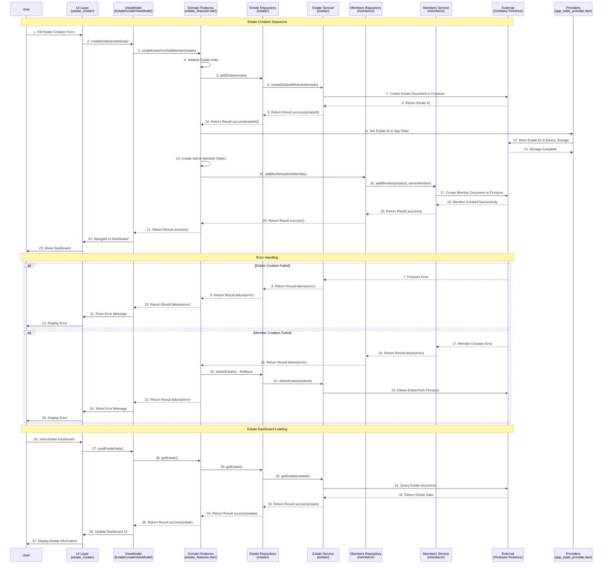

```mermaid
sequenceDiagram
    participant U as User
    participant UI as UI Layer<br/>(estate_create/)
    participant VM as ViewModel<br/>(EstateCreateViewModel)
    participant F as Domain Features<br/>(estate_features.dart)
    participant ER as Estate Repository<br/>(estate/)
    participant ES as Estate Service<br/>(estate/)
    participant MR as Members Repository<br/>(members/)
    participant MS as Members Service<br/>(members/)
    participant E as External<br/>(Firebase Firestore)
    participant P as Providers<br/>(app_state_provider.dart)

    Note over U,E: Estate Creation Sequence
    
    U->>UI: 1. Fill Estate Creation Form
    UI->>VM: 2. createEstate(estateData)
    VM->>F: 3. createEstateAndAddMember(estate)
    
    F->>F: 4. Validate Estate Data
    F->>ER: 5. addEstate(estate)
    ER->>ES: 6. createEstateWithAutoId(estate)
    ES->>E: 7. Create Estate Document in Firestore
    E-->>ES: 8. Return Estate ID
    ES-->>ER: 9. Return Result.success(estateId)
    ER-->>F: 10. Return Result.success(estateId)
    
    F->>P: 11. Set Estate ID in App State
    P->>E: 12. Store Estate ID in Device Storage
    E-->>P: 13. Storage Complete
    
    F->>F: 14. Create Admin Member Object
    F->>MR: 15. addMember(adminMember)
    MR->>MS: 16. addMember(estateId, adminMember)
    MS->>E: 17. Create Member Document in Firestore
    E-->>MS: 18. Member Created Successfully
    MS-->>MR: 19. Return Result.success()
    MR-->>F: 20. Return Result.success()
    
    F-->>VM: 21. Return Result.success()
    VM->>UI: 22. Navigate to Dashboard
    UI->>U: 23. Show Dashboard

    Note over U,E: Error Handling
    
    alt Estate Creation Failed
        E-->>ES: 7. Firestore Error
        ES-->>ER: 8. Return Result.failure(error)
        ER-->>F: 9. Return Result.failure(error)
        F-->>VM: 10. Return Result.failure(error)
        VM->>UI: 11. Show Error Message
        UI->>U: 12. Display Error
    end
    
    alt Member Creation Failed
        E-->>MS: 17. Member Creation Error
        MS-->>MR: 18. Return Result.failure(error)
        MR-->>F: 19. Return Result.failure(error)
        F->>ER: 20. deleteEstate() - Rollback
        ER->>ES: 21. deleteEstate(estateId)
        ES->>E: 22. Delete Estate from Firestore
        F-->>VM: 23. Return Result.failure(error)
        VM->>UI: 24. Show Error Message
        UI->>U: 25. Display Error
    end

    Note over U,E: Estate Dashboard Loading
    
    U->>UI: 26. View Estate Dashboard
    UI->>VM: 27. loadEstateData()
    VM->>F: 28. getEstate()
    F->>ER: 29. getEstate()
    ER->>ES: 30. getEstate(estateId)
    ES->>E: 31. Query Estate Document
    E-->>ES: 32. Return Estate Data
    ES-->>ER: 33. Return Result.success(estate)
    ER-->>F: 34. Return Result.success(estate)
    F-->>VM: 35. Return Result.success(estate)
    VM->>UI: 36. Update Dashboard UI
    UI->>U: 37. Display Estate Information
``` 