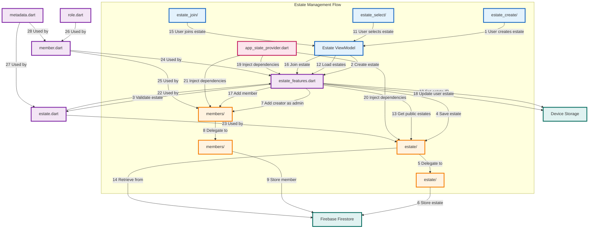

```mermaid
graph TB
    %% Estate Management Flow Only
    subgraph "Estate Management Flow"
        EstateCreateScreen[estate_create/]
        EstateJoinScreen[estate_join/]
        EstateSelectScreen[estate_select/]
        EstateViewModel[Estate ViewModel]
        EstateFeatures[estate_features.dart]
        EstateRepo[estate/]
        EstateService[estate/]
        MembersRepo[members/]
        MembersService[members/]
        AppStateProvider[app_state_provider.dart]
    end
    
    %% Domain Models
    EstateModel[estate.dart]
    MemberModel[member.dart]
    RoleModel[role.dart]
    MetadataModel[metadata.dart]
    
    %% External Systems
    Firestore[Firebase Firestore]
    DeviceStorage[Device Storage]
    
    %% Estate Creation Flow - Clear Path
    EstateCreateScreen -->|1 User creates estate| EstateViewModel
    EstateViewModel -->|2 Create estate| EstateFeatures
    EstateFeatures -->|3 Validate estate| EstateModel
    EstateFeatures -->|4 Save estate| EstateRepo
    EstateRepo -->|5 Delegate to| EstateService
    EstateService -->|6 Store estate| Firestore
    EstateFeatures -->|7 Add creator as admin| MembersRepo
    MembersRepo -->|8 Delegate to| MembersService
    MembersService -->|9 Store member| Firestore
    EstateFeatures -->|10 Set estate ID| DeviceStorage
    
    %% Estate Selection Flow
    EstateSelectScreen -->|11 User selects estate| EstateViewModel
    EstateViewModel -->|12 Load estates| EstateFeatures
    EstateFeatures -->|13 Get public estates| EstateRepo
    EstateRepo -->|14 Retrieve from| Firestore
    
    %% Estate Join Flow
    EstateJoinScreen -->|15 User joins estate| EstateViewModel
    EstateViewModel -->|16 Join estate| EstateFeatures
    EstateFeatures -->|17 Add member| MembersRepo
    EstateFeatures -->|18 Update user estate| DeviceStorage
    
    %% State Management
    AppStateProvider -->|19 Inject dependencies| EstateFeatures
    AppStateProvider -->|20 Inject dependencies| EstateRepo
    AppStateProvider -->|21 Inject dependencies| MembersRepo
    
    %% Domain Models
    EstateModel -->|22 Used by| EstateFeatures
    EstateModel -->|23 Used by| EstateRepo
    MemberModel -->|24 Used by| EstateFeatures
    MemberModel -->|25 Used by| MembersRepo
    RoleModel -->|26 Used by| MemberModel
    MetadataModel -->|27 Used by| EstateModel
    MetadataModel -->|28 Used by| MemberModel
    
    %% Styling
    classDef ui fill:#e3f2fd,stroke:#1565c0,stroke-width:3px
    classDef domain fill:#f3e5f5,stroke:#7b1fa2,stroke-width:3px
    classDef data fill:#fff3e0,stroke:#f57c00,stroke-width:3px
    classDef infrastructure fill:#fce4ec,stroke:#c2185b,stroke-width:3px
    classDef external fill:#e0f2f1,stroke:#00695c,stroke-width:3px
    
    class EstateCreateScreen,EstateJoinScreen,EstateSelectScreen,EstateViewModel ui
    class EstateFeatures,EstateModel,MemberModel,RoleModel,MetadataModel domain
    class EstateRepo,EstateService,MembersRepo,MembersService data
    class AppStateProvider infrastructure
    class Firestore,DeviceStorage external
``` 