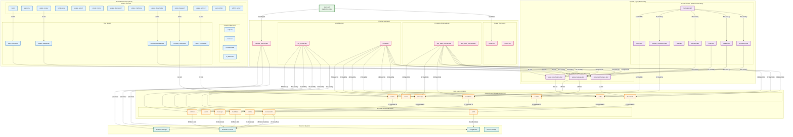

```mermaid
graph TB
    %% Application Entry
    Main[main.dart<br/>Application Entry]
    
    %% Presentation Layer (UI)
    subgraph "Presentation Layer (lib/ui/)"
        subgraph "Feature Screens"
            Login[login/]
            Welcome[welcome/]
            EstateCreate[estate_create/]
            EstateJoin[estate_join/]
            EstateSelect[estate_select/]
            EstateHome[estate_home/]
            EstateDashboard[estate_dashboard/]
            EstateMembers[estate_members/]
            EstateDocuments[estate_documents/]
            EstateTreasury[estate_treasury/]
            EstateNotices[estate_notices/]
            UserProfile[user_profile/]
            AdminPanel[admin_panel/]
        end
        
        subgraph "Core UI (lib/ui/core/)"
            CoreWidgets[widgets/]
            CoreThemes[themes/]
            CoreConstants[constants.dart]
            CoreUIState[ui_state.dart]
        end
        
        subgraph "View Models"
            AuthViewModel[Auth ViewModel]
            DocumentViewModel[Document ViewModel]
            EstateViewModel[Estate ViewModel]
            TreasuryViewModel[Treasury ViewModel]
            NoticeViewModel[Notice ViewModel]
        end
    end
    
    %% Domain Layer (lib/domain/)
    subgraph "Domain Layer (lib/domain/)"
        subgraph "Domain Models (lib/domain/models/)"
            DocumentModel[document.dart]
            NoticeModel[notice.dart]
            RoleModel[role.dart]
            TreasuryModel[treasury_transaction.dart]
            UserModel[user.dart]
            EstateModel[estate.dart]
            MemberModel[member.dart]
            MetadataModel[metadata.dart]
        end
        
        subgraph "Domain Features (lib/domain/features/)"
            DocumentFeatures[document_features.dart]
            EstateFeatures[estate_features.dart]
            UserSignInFeature[user_sigin_feature.dart]
        end
    end
    
    %% Data Layer (lib/data/)
    subgraph "Data Layer (lib/data/)"
        subgraph "Repositories (lib/data/repositories/)"
            AuthRepo[auth/]
            UsersRepo[users/]
            EstateRepo[estate/]
            MembersRepo[members/]
            DocumentsRepo[document/]
            TreasuryRepo[treasury/]
            NoticeRepo[notice/]
        end
        
        subgraph "Services (lib/data/services/)"
            AuthService[auth/]
            UsersService[users/]
            EstateService[estate/]
            MembersService[members/]
            DocumentsService[documents/]
            TreasuryService[treasury/]
            NoticeService[notices/]
        end
    end
    
    %% Infrastructure Layer
    subgraph "Infrastructure Layer"
        subgraph "Providers (lib/providers/)"
            AppStateProvider[app_state_provider.dart]
            AuthStateProvider[auth_state_provider.dart]
        end
        
        subgraph "Utils (lib/utils/)"
            LogPrinter[log_printer.dart]
            Result[result.dart]
        end
        
        subgraph "Router (lib/router/)"
            Router[router.dart]
            Routes[routes.dart]
        end
        
        FirebaseConfig[firebase_options.dart]
    end
    
    %% External Systems
    subgraph "External Systems"
        GoogleAuth[Google Auth]
        Firestore[Firebase Firestore]
        Storage[Firebase Storage]
        DeviceStorage[Device Storage]
    end
    
    %% Application Flow - Following Architecture Layers
    Main -->|1 Initialize| Router
    Main -->|2 Configure| FirebaseConfig
    FirebaseConfig -->|3 Connect| GoogleAuth
    FirebaseConfig -->|4 Connect| Firestore
    FirebaseConfig -->|5 Connect| Storage
    
    %% Presentation to Domain Flow
    Login -->|6 Use| AuthViewModel
    EstateDocuments -->|7 Use| DocumentViewModel
    EstateCreate -->|8 Use| EstateViewModel
    EstateTreasury -->|9 Use| TreasuryViewModel
    EstateNotices -->|10 Use| NoticeViewModel
    
    AuthViewModel -->|11 Call| UserSignInFeature
    DocumentViewModel -->|12 Call| DocumentFeatures
    EstateViewModel -->|13 Call| EstateFeatures
    TreasuryViewModel -->|14 Call| TreasuryRepo
    NoticeViewModel -->|15 Call| NoticeRepo
    
    %% Domain to Data Flow
    UserSignInFeature -->|16 Use| AuthRepo
    DocumentFeatures -->|17 Use| DocumentsRepo
    EstateFeatures -->|18 Use| EstateRepo
    EstateFeatures -->|19 Use| MembersRepo
    
    %% Repository to Service Flow
    AuthRepo -->|20 Delegate to| AuthService
    DocumentsRepo -->|21 Delegate to| DocumentsService
    EstateRepo -->|22 Delegate to| EstateService
    MembersRepo -->|23 Delegate to| MembersService
    TreasuryRepo -->|24 Delegate to| TreasuryService
    NoticeRepo -->|25 Delegate to| NoticeService
    
    %% Service to External Flow
    AuthService -->|26 Authenticate| GoogleAuth
    DocumentsService -->|27 Store files| Storage
    DocumentsService -->|28 Store metadata| Firestore
    EstateService -->|29 Store data| Firestore
    MembersService -->|30 Store data| Firestore
    TreasuryService -->|31 Store data| Firestore
    NoticeService -->|32 Store data| Firestore
    
    %% Dependency Injection Flow
    AppStateProvider -->|33 Inject into| UserSignInFeature
    AppStateProvider -->|34 Inject into| DocumentFeatures
    AppStateProvider -->|35 Inject into| EstateFeatures
    AppStateProvider -->|36 Inject into| AuthRepo
    AppStateProvider -->|37 Inject into| DocumentsRepo
    AppStateProvider -->|38 Inject into| EstateRepo
    AppStateProvider -->|39 Inject into| MembersRepo
    AppStateProvider -->|40 Inject into| TreasuryRepo
    AppStateProvider -->|41 Inject into| NoticeRepo
    
    %% Utility Usage Flow
    Result -->|42 Used by| UserSignInFeature
    Result -->|43 Used by| DocumentFeatures
    Result -->|44 Used by| EstateFeatures
    Result -->|45 Used by| AuthRepo
    Result -->|46 Used by| DocumentsRepo
    Result -->|47 Used by| EstateRepo
    Result -->|48 Used by| MembersRepo
    Result -->|49 Used by| TreasuryRepo
    Result -->|50 Used by| NoticeRepo
    
    LogPrinter -->|51 Used by| AuthService
    LogPrinter -->|52 Used by| DocumentsService
    LogPrinter -->|53 Used by| EstateService
    LogPrinter -->|54 Used by| MembersService
    LogPrinter -->|55 Used by| TreasuryService
    LogPrinter -->|56 Used by| NoticeService
    
    %% Domain Model Usage
    UserModel -->|57 Used by| UserSignInFeature
    DocumentModel -->|58 Used by| DocumentFeatures
    EstateModel -->|59 Used by| EstateFeatures
    MemberModel -->|60 Used by| EstateFeatures
    TreasuryModel -->|61 Used by| TreasuryRepo
    NoticeModel -->|62 Used by| NoticeRepo
    MetadataModel -->|63 Used by| DocumentModel
    MetadataModel -->|64 Used by| EstateModel
    MetadataModel -->|65 Used by| MemberModel
    MetadataModel -->|66 Used by| TreasuryModel
    MetadataModel -->|67 Used by| NoticeModel
    
    %% Styling
    classDef entry fill:#e8f5e8,stroke:#2e7d32,stroke-width:3px
    classDef presentation fill:#e3f2fd,stroke:#1565c0,stroke-width:2px
    classDef domain fill:#f3e5f5,stroke:#7b1fa2,stroke-width:2px
    classDef data fill:#fff3e0,stroke:#f57c00,stroke-width:2px
    classDef infrastructure fill:#fce4ec,stroke:#c2185b,stroke-width:2px
    classDef external fill:#e0f2f1,stroke:#00695c,stroke-width:2px
    
    class Main entry
    class Login,Welcome,EstateCreate,EstateJoin,EstateSelect,EstateHome,EstateDashboard,EstateMembers,EstateDocuments,EstateTreasury,EstateNotices,UserProfile,AdminPanel,CoreWidgets,CoreThemes,CoreConstants,CoreUIState,AuthViewModel,DocumentViewModel,EstateViewModel,TreasuryViewModel,NoticeViewModel presentation
    class DocumentModel,NoticeModel,RoleModel,TreasuryModel,UserModel,EstateModel,MemberModel,MetadataModel,DocumentFeatures,EstateFeatures,UserSignInFeature domain
    class AuthRepo,UsersRepo,EstateRepo,MembersRepo,DocumentsRepo,TreasuryRepo,NoticeRepo,AuthService,UsersService,EstateService,MembersService,DocumentsService,TreasuryService,NoticeService data
    class AppStateProvider,AuthStateProvider,LogPrinter,Result,Router,Routes,FirebaseConfig infrastructure
    class GoogleAuth,Firestore,Storage,DeviceStorage external
``` 