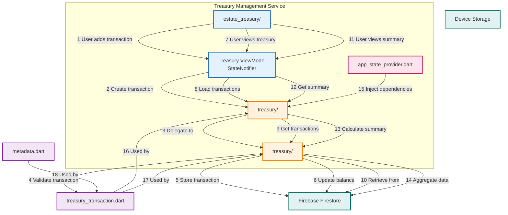

```mermaid
graph TB
    %% Treasury Management Service Flow
    subgraph "Treasury Management Service"
        TreasuryScreen[estate_treasury/]
        TreasuryViewModel[Treasury ViewModel<br/>StateNotifier]
        TreasuryRepo[treasury/]
        TreasuryService[treasury/]
        AppStateProvider[app_state_provider.dart]
    end
    
    %% Domain Models
    TreasuryModel[treasury_transaction.dart]
    MetadataModel[metadata.dart]
    
    %% External Systems
    Firestore[Firebase Firestore]
    DeviceStorage[Device Storage]
    
    %% Treasury Transaction Flow
    TreasuryScreen -->|1 User adds transaction| TreasuryViewModel
    TreasuryViewModel -->|2 Create transaction| TreasuryRepo
    TreasuryRepo -->|3 Delegate to| TreasuryService
    TreasuryService -->|4 Validate transaction| TreasuryModel
    TreasuryService -->|5 Store transaction| Firestore
    TreasuryService -->|6 Update balance| Firestore
    
    %% Treasury View Flow
    TreasuryScreen -->|7 User views treasury| TreasuryViewModel
    TreasuryViewModel -->|8 Load transactions| TreasuryRepo
    TreasuryRepo -->|9 Get transactions| TreasuryService
    TreasuryService -->|10 Retrieve from| Firestore
    
    %% Treasury Summary Flow
    TreasuryScreen -->|11 User views summary| TreasuryViewModel
    TreasuryViewModel -->|12 Get summary| TreasuryRepo
    TreasuryRepo -->|13 Calculate summary| TreasuryService
    TreasuryService -->|14 Aggregate data| Firestore
    
    %% State Management
    AppStateProvider -->|15 Inject dependencies| TreasuryRepo
    
    %% Domain Models
    TreasuryModel -->|16 Used by| TreasuryRepo
    TreasuryModel -->|17 Used by| TreasuryService
    MetadataModel -->|18 Used by| TreasuryModel
    
    %% Styling
    classDef ui fill:#e3f2fd,stroke:#1565c0,stroke-width:2px
    classDef domain fill:#f3e5f5,stroke:#7b1fa2,stroke-width:2px
    classDef data fill:#fff3e0,stroke:#f57c00,stroke-width:2px
    classDef infrastructure fill:#fce4ec,stroke:#c2185b,stroke-width:2px
    classDef external fill:#e0f2f1,stroke:#00695c,stroke-width:2px
    
    class TreasuryScreen,TreasuryViewModel ui
    class TreasuryModel,MetadataModel domain
    class TreasuryRepo,TreasuryService data
    class AppStateProvider infrastructure
    class Firestore,DeviceStorage external
``` 