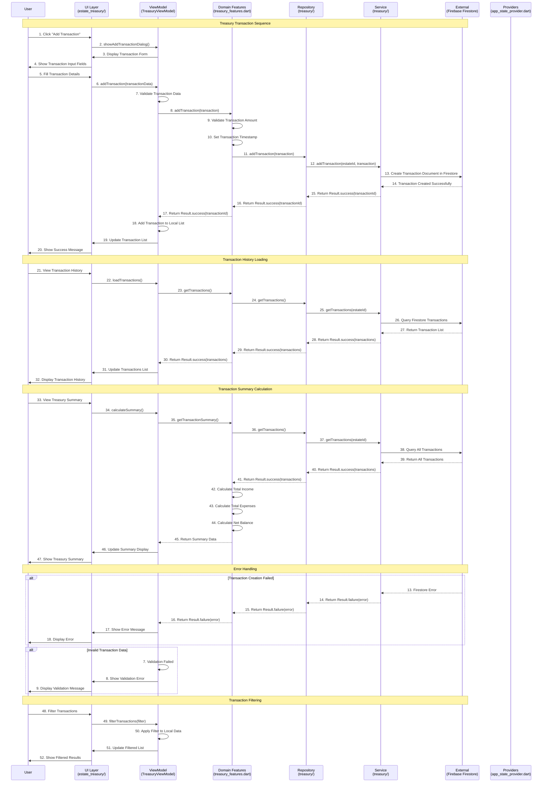

```mermaid
sequenceDiagram
    participant U as User
    participant UI as UI Layer<br/>(estate_treasury/)
    participant VM as ViewModel<br/>(TreasuryViewModel)
    participant F as Domain Features<br/>(treasury_features.dart)
    participant R as Repository<br/>(treasury/)
    participant S as Service<br/>(treasury/)
    participant E as External<br/>(Firebase Firestore)
    participant P as Providers<br/>(app_state_provider.dart)

    Note over U,E: Treasury Transaction Sequence
    
    U->>UI: 1. Click "Add Transaction"
    UI->>VM: 2. showAddTransactionDialog()
    VM->>UI: 3. Display Transaction Form
    UI->>U: 4. Show Transaction Input Fields
    
    U->>UI: 5. Fill Transaction Details
    UI->>VM: 6. addTransaction(transactionData)
    VM->>VM: 7. Validate Transaction Data
    VM->>F: 8. addTransaction(transaction)
    
    F->>F: 9. Validate Transaction Amount
    F->>F: 10. Set Transaction Timestamp
    F->>R: 11. addTransaction(transaction)
    R->>S: 12. addTransaction(estateId, transaction)
    S->>E: 13. Create Transaction Document in Firestore
    E-->>S: 14. Transaction Created Successfully
    S-->>R: 15. Return Result.success(transactionId)
    R-->>F: 16. Return Result.success(transactionId)
    F-->>VM: 17. Return Result.success(transactionId)
    
    VM->>VM: 18. Add Transaction to Local List
    VM->>UI: 19. Update Transaction List
    UI->>U: 20. Show Success Message

    Note over U,E: Transaction History Loading
    
    U->>UI: 21. View Transaction History
    UI->>VM: 22. loadTransactions()
    VM->>F: 23. getTransactions()
    F->>R: 24. getTransactions()
    R->>S: 25. getTransactions(estateId)
    S->>E: 26. Query Firestore Transactions
    E-->>S: 27. Return Transaction List
    S-->>R: 28. Return Result.success(transactions)
    R-->>F: 29. Return Result.success(transactions)
    F-->>VM: 30. Return Result.success(transactions)
    VM->>UI: 31. Update Transactions List
    UI->>U: 32. Display Transaction History

    Note over U,E: Transaction Summary Calculation
    
    U->>UI: 33. View Treasury Summary
    UI->>VM: 34. calculateSummary()
    VM->>F: 35. getTransactionSummary()
    F->>R: 36. getTransactions()
    R->>S: 37. getTransactions(estateId)
    S->>E: 38. Query All Transactions
    E-->>S: 39. Return All Transactions
    S-->>R: 40. Return Result.success(transactions)
    R-->>F: 41. Return Result.success(transactions)
    
    F->>F: 42. Calculate Total Income
    F->>F: 43. Calculate Total Expenses
    F->>F: 44. Calculate Net Balance
    F-->>VM: 45. Return Summary Data
    VM->>UI: 46. Update Summary Display
    UI->>U: 47. Show Treasury Summary

    Note over U,E: Error Handling
    
    alt Transaction Creation Failed
        E-->>S: 13. Firestore Error
        S-->>R: 14. Return Result.failure(error)
        R-->>F: 15. Return Result.failure(error)
        F-->>VM: 16. Return Result.failure(error)
        VM->>UI: 17. Show Error Message
        UI->>U: 18. Display Error
    end
    
    alt Invalid Transaction Data
        VM->>VM: 7. Validation Failed
        VM->>UI: 8. Show Validation Error
        UI->>U: 9. Display Validation Message
    end

    Note over U,E: Transaction Filtering
    
    U->>UI: 48. Filter Transactions
    UI->>VM: 49. filterTransactions(filter)
    VM->>VM: 50. Apply Filter to Local Data
    VM->>UI: 51. Update Filtered List
    UI->>U: 52. Show Filtered Results
``` 