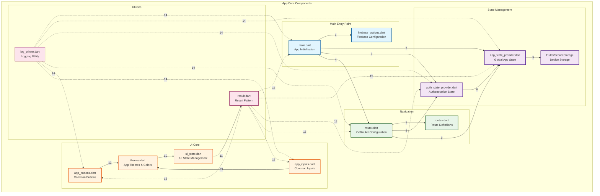

```mermaid
graph TB
    subgraph "App Core Components"
        subgraph "Main Entry Point"
            Main[main.dart\nApp Initialization]
            FirebaseConfig[firebase_options.dart\nFirebase Configuration]
        end
        
        subgraph "State Management"
            AppStateProvider[app_state_provider.dart\nGlobal App State]
            AuthStateProvider[auth_state_provider.dart\nAuthentication State]
            SecureStorage[FlutterSecureStorage\nDevice Storage]
        end
        
        subgraph "Navigation"
            Router[router.dart\nGoRouter Configuration]
            Routes[routes.dart\nRoute Definitions]
        end
        
        subgraph "UI Core"
            Themes[themes.dart\nApp Themes & Colors]
            UIState[ui_state.dart\nUI State Management]
            AppButtons[app_buttons.dart\nCommon Buttons]
            AppInputs[app_inputs.dart\nCommon Inputs]
        end
        
        subgraph "Utilities"
            LogPrinter[log_printer.dart\nLogging Utility]
            Result[result.dart\nResult Pattern]
        end
    end
    
    Main --1--> FirebaseConfig
    Main --2--> AppStateProvider
    Main --3--> AuthStateProvider
    Main --4--> Router
    
    AppStateProvider --5--> SecureStorage
    AuthStateProvider --6--> AppStateProvider
    
    Router --7--> Routes
    Router --8--> AuthStateProvider
    Router --9--> AppStateProvider
    
    Themes --10--> UIState
    UIState --11--> Result
    AppButtons --12--> Themes
    AppInputs --13--> Themes
    
    LogPrinter -.14 .-> Main
    LogPrinter -.14 .-> AppStateProvider
    LogPrinter -.14 .-> AuthStateProvider
    LogPrinter -.14 .-> Router
    LogPrinter -.14 .-> AppButtons
    LogPrinter -.14 .-> AppInputs
    
    Result -.15 .-> Main
    Result -.15 .-> AppStateProvider
    Result -.15 .-> AuthStateProvider
    Result -.15 .-> Router
    Result -.15 .-> AppButtons
    Result -.15 .-> AppInputs
    
    %% Styling
    classDef core fill:#e1f5fe,stroke:#01579b,stroke-width:2px
    classDef state fill:#f3e5f5,stroke:#4a148c,stroke-width:2px
    classDef nav fill:#e8f5e8,stroke:#1b5e20,stroke-width:2px
    classDef ui fill:#fff3e0,stroke:#e65100,stroke-width:2px
    classDef util fill:#fce4ec,stroke:#880e4f,stroke-width:2px
    
    class Main,FirebaseConfig core
    class AppStateProvider,AuthStateProvider,SecureStorage state
    class Router,Routes nav
    class Themes,UIState,AppButtons,AppInputs ui
    class LogPrinter,Result util
``` 