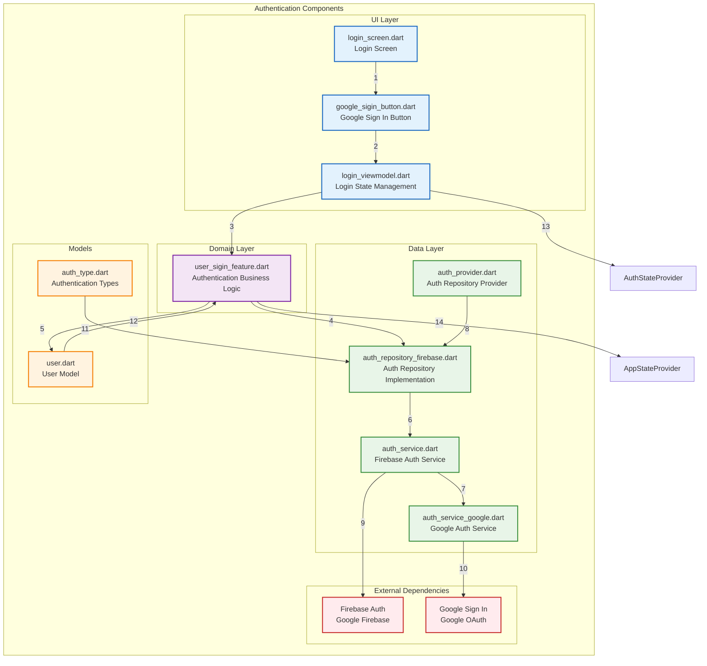

```mermaid
graph TB
    subgraph "Authentication Components"
        subgraph "UI Layer"
            LoginScreen[login_screen.dart\nLogin Screen]
            GoogleSignInButton[google_sigin_button.dart\nGoogle Sign In Button]
            LoginViewModel[login_viewmodel.dart\nLogin State Management]
        end
        
        subgraph "Domain Layer"
            UserSignInFeature[user_sigin_feature.dart\nAuthentication Business Logic]
        end
        
        subgraph "Data Layer"
            AuthRepository[auth_repository_firebase.dart\nAuth Repository Implementation]
            AuthProvider[auth_provider.dart\nAuth Repository Provider]
            AuthService[auth_service.dart\nFirebase Auth Service]
            AuthServiceGoogle[auth_service_google.dart\nGoogle Auth Service]
        end
        
        subgraph "Models"
            AuthType[auth_type.dart\nAuthentication Types]
            User[user.dart\nUser Model]
        end
        
        subgraph "External Dependencies"
            FirebaseAuth[Firebase Auth\nGoogle Firebase]
            GoogleSignIn[Google Sign In\nGoogle OAuth]
        end
    end
    
    LoginScreen --1--> GoogleSignInButton
    GoogleSignInButton --2--> LoginViewModel
    LoginViewModel --3--> UserSignInFeature
    UserSignInFeature --4--> AuthRepository
    UserSignInFeature --5--> User
    AuthRepository --6--> AuthService
    AuthService --7--> AuthServiceGoogle
    AuthProvider --8--> AuthRepository
    AuthService --9--> FirebaseAuth
    AuthServiceGoogle --10--> GoogleSignIn
    AuthType --11--> AuthRepository
    User --12--> UserSignInFeature
    LoginViewModel --13--> AuthStateProvider
    UserSignInFeature --14--> AppStateProvider
    
    %% Styling
    classDef ui fill:#e3f2fd,stroke:#1565c0,stroke-width:2px
    classDef domain fill:#f3e5f5,stroke:#7b1fa2,stroke-width:2px
    classDef data fill:#e8f5e8,stroke:#388e3c,stroke-width:2px
    classDef model fill:#fff3e0,stroke:#f57c00,stroke-width:2px
    classDef external fill:#ffebee,stroke:#c62828,stroke-width:2px
    
    class LoginScreen,GoogleSignInButton,LoginViewModel ui
    class UserSignInFeature domain
    class AuthRepository,AuthProvider,AuthService,AuthServiceGoogle data
    class AuthType,User model
    class FirebaseAuth,GoogleSignIn external
``` 