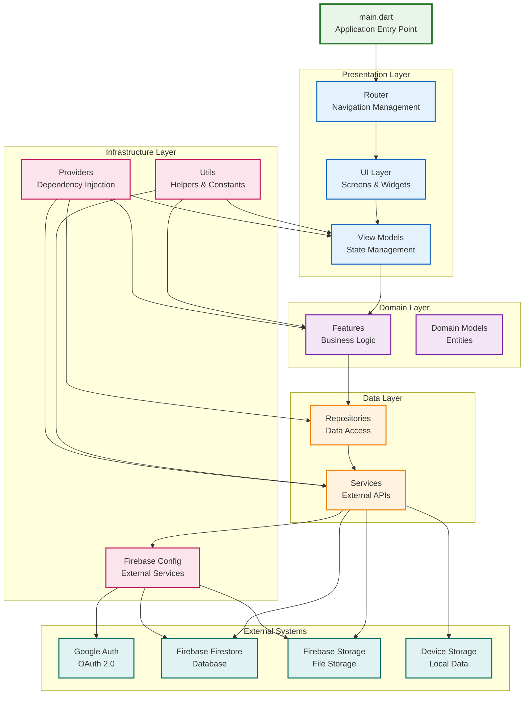

```mermaid
graph TB
    %% Main Application Entry
    Main[main.dart<br/>Application Entry Point]
    
    %% Presentation Layer (UI)
    subgraph "Presentation Layer"
        Router[Router<br/>Navigation Management]
        UI[UI Layer<br/>Screens & Widgets]
        ViewModels[View Models<br/>State Management]
    end
    
    %% Domain Layer
    subgraph "Domain Layer"
        Features[Features<br/>Business Logic]
        Models[Domain Models<br/>Entities]
    end
    
    %% Data Layer
    subgraph "Data Layer"
        Repositories[Repositories<br/>Data Access]
        Services[Services<br/>External APIs]
    end
    
    %% Infrastructure Layer
    subgraph "Infrastructure Layer"
        Providers[Providers<br/>Dependency Injection]
        Utils[Utils<br/>Helpers & Constants]
        Firebase[Firebase Config<br/>External Services]
    end
    
    %% External Systems
    subgraph "External Systems"
        GoogleAuth[Google Auth<br/>OAuth 2.0]
        Firestore[Firebase Firestore<br/>Database]
        Storage[Firebase Storage<br/>File Storage]
        DeviceStorage[Device Storage<br/>Local Data]
    end
    
    %% Relationships - Application Flow
    Main --> Router
    Router --> UI
    UI --> ViewModels
    ViewModels --> Features
    Features --> Repositories
    Repositories --> Services
    Services --> Firebase
    
    %% Relationships - Dependency Injection
    Providers --> ViewModels
    Providers --> Features
    Providers --> Repositories
    Providers --> Services
    
    %% Relationships - External Dependencies
    Firebase --> GoogleAuth
    Firebase --> Firestore
    Firebase --> Storage
    Utils --> ViewModels
    Utils --> Features
    Utils --> Services
    
    %% Relationships - Data Flow
    Services --> Firestore
    Services --> Storage
    Services --> DeviceStorage
    
    %% Styling
    classDef entry fill:#e8f5e8,stroke:#2e7d32,stroke-width:3px
    classDef presentation fill:#e3f2fd,stroke:#1565c0,stroke-width:2px
    classDef domain fill:#f3e5f5,stroke:#7b1fa2,stroke-width:2px
    classDef data fill:#fff3e0,stroke:#f57c00,stroke-width:2px
    classDef infrastructure fill:#fce4ec,stroke:#c2185b,stroke-width:2px
    classDef external fill:#e0f2f1,stroke:#00695c,stroke-width:2px
    
    class Main entry
    class Router,UI,ViewModels presentation
    class Features,Models domain
    class Repositories,Services data
    class Providers,Utils,Firebase infrastructure
    class GoogleAuth,Firestore,Storage,DeviceStorage external
``` 