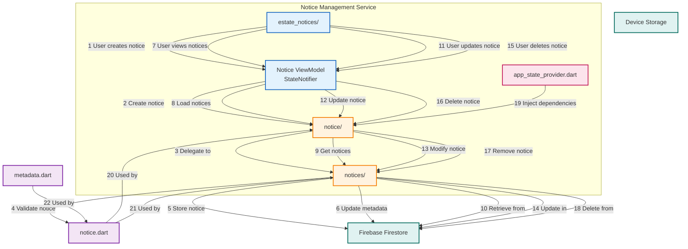

```mermaid
graph TB
    %% Notice Management Service Flow
    subgraph "Notice Management Service"
        NoticeScreen[estate_notices/]
        NoticeViewModel[Notice ViewModel<br/>StateNotifier]
        NoticeRepo[notice/]
        NoticeService[notices/]
        AppStateProvider[app_state_provider.dart]
    end
    
    %% Domain Models
    NoticeModel[notice.dart]
    MetadataModel[metadata.dart]
    
    %% External Systems
    Firestore[Firebase Firestore]
    DeviceStorage[Device Storage]
    
    %% Notice Creation Flow
    NoticeScreen -->|1 User creates notice| NoticeViewModel
    NoticeViewModel -->|2 Create notice| NoticeRepo
    NoticeRepo -->|3 Delegate to| NoticeService
    NoticeService -->|4 Validate notice| NoticeModel
    NoticeService -->|5 Store notice| Firestore
    NoticeService -->|6 Update metadata| Firestore
    
    %% Notice View Flow
    NoticeScreen -->|7 User views notices| NoticeViewModel
    NoticeViewModel -->|8 Load notices| NoticeRepo
    NoticeRepo -->|9 Get notices| NoticeService
    NoticeService -->|10 Retrieve from| Firestore
    
    %% Notice Update Flow
    NoticeScreen -->|11 User updates notice| NoticeViewModel
    NoticeViewModel -->|12 Update notice| NoticeRepo
    NoticeRepo -->|13 Modify notice| NoticeService
    NoticeService -->|14 Update in| Firestore
    
    %% Notice Delete Flow
    NoticeScreen -->|15 User deletes notice| NoticeViewModel
    NoticeViewModel -->|16 Delete notice| NoticeRepo
    NoticeRepo -->|17 Remove notice| NoticeService
    NoticeService -->|18 Delete from| Firestore
    
    %% State Management
    AppStateProvider -->|19 Inject dependencies| NoticeRepo
    
    %% Domain Models
    NoticeModel -->|20 Used by| NoticeRepo
    NoticeModel -->|21 Used by| NoticeService
    MetadataModel -->|22 Used by| NoticeModel
    
    %% Styling
    classDef ui fill:#e3f2fd,stroke:#1565c0,stroke-width:2px
    classDef domain fill:#f3e5f5,stroke:#7b1fa2,stroke-width:2px
    classDef data fill:#fff3e0,stroke:#f57c00,stroke-width:2px
    classDef infrastructure fill:#fce4ec,stroke:#c2185b,stroke-width:2px
    classDef external fill:#e0f2f1,stroke:#00695c,stroke-width:2px
    
    class NoticeScreen,NoticeViewModel ui
    class NoticeModel,MetadataModel domain
    class NoticeRepo,NoticeService data
    class AppStateProvider infrastructure
    class Firestore,DeviceStorage external
``` 