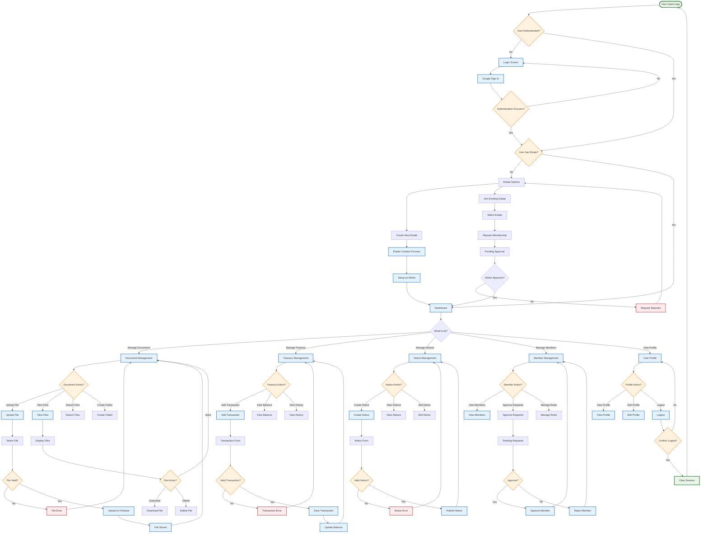

```mermaid
flowchart TD
    %% User Journey Flow
    Start([User Opens App]) --> Auth{User Authenticated?}
    
    Auth -->|No| Login[Login Screen]
    Login --> GoogleSignIn[Google Sign In]
    GoogleSignIn --> AuthSuccess{Authentication Success?}
    AuthSuccess -->|No| Login
    AuthSuccess -->|Yes| EstateCheck{User has Estate?}
    
    Auth -->|Yes| EstateCheck
    
    EstateCheck -->|No| EstateOptions[Estate Options]
    EstateOptions --> CreateEstate[Create New Estate]
    EstateOptions --> JoinEstate[Join Existing Estate]
    
    CreateEstate --> EstateCreation[Estate Creation Process]
    EstateCreation --> AdminSetup[Setup as Admin]
    AdminSetup --> Dashboard[Dashboard]
    
    JoinEstate --> EstateSelection[Select Estate]
    EstateSelection --> MemberRequest[Request Membership]
    MemberRequest --> PendingApproval[Pending Approval]
    PendingApproval --> AdminApproval{Admin Approves?}
    AdminApproval -->|No| Rejected[Request Rejected]
    AdminApproval -->|Yes| Dashboard
    
    EstateCheck -->|Yes| Dashboard
    
    %% Dashboard Activities
    Dashboard --> Activities{What to do?}
    
    Activities -->|Manage Documents| DocumentManagement[Document Management]
    Activities -->|Manage Treasury| TreasuryManagement[Treasury Management]
    Activities -->|Manage Notices| NoticeManagement[Notice Management]
    Activities -->|Manage Members| MemberManagement[Member Management]
    Activities -->|View Profile| UserProfile[User Profile]
    
    %% Document Management Flow
    DocumentManagement --> DocActions{Document Action?}
    DocActions -->|Upload File| UploadFile[Upload File]
    DocActions -->|View Files| ViewFiles[View Files]
    DocActions -->|Search Files| SearchFiles[Search Files]
    DocActions -->|Create Folder| CreateFolder[Create Folder]
    
    UploadFile --> FilePicker[Select File]
    FilePicker --> FileValidation{File Valid?}
    FileValidation -->|No| FileError[File Error]
    FileValidation -->|Yes| FileUpload[Upload to Firebase]
    FileUpload --> FileStored[File Stored]
    FileStored --> DocumentManagement
    
    ViewFiles --> FileList[Display Files]
    FileList --> FileAction{File Action?}
    FileAction -->|Download| DownloadFile[Download File]
    FileAction -->|Delete| DeleteFile[Delete File]
    FileAction -->|Back| DocumentManagement
    
    %% Treasury Management Flow
    TreasuryManagement --> TreasuryActions{Treasury Action?}
    TreasuryActions -->|Add Transaction| AddTransaction[Add Transaction]
    TreasuryActions -->|View Balance| ViewBalance[View Balance]
    TreasuryActions -->|View History| ViewHistory[View History]
    
    AddTransaction --> TransactionForm[Transaction Form]
    TransactionForm --> TransactionValidation{Valid Transaction?}
    TransactionValidation -->|No| TransactionError[Transaction Error]
    TransactionValidation -->|Yes| SaveTransaction[Save Transaction]
    SaveTransaction --> UpdateBalance[Update Balance]
    UpdateBalance --> TreasuryManagement
    
    %% Notice Management Flow
    NoticeManagement --> NoticeActions{Notice Action?}
    NoticeActions -->|Create Notice| CreateNotice[Create Notice]
    NoticeActions -->|View Notices| ViewNotices[View Notices]
    NoticeActions -->|Edit Notice| EditNotice[Edit Notice]
    
    CreateNotice --> NoticeForm[Notice Form]
    NoticeForm --> NoticeValidation{Valid Notice?}
    NoticeValidation -->|No| NoticeError[Notice Error]
    NoticeValidation -->|Yes| PublishNotice[Publish Notice]
    PublishNotice --> NoticeManagement
    
    %% Member Management Flow
    MemberManagement --> MemberActions{Member Action?}
    MemberActions -->|View Members| ViewMembers[View Members]
    MemberActions -->|Approve Requests| ApproveRequests[Approve Requests]
    MemberActions -->|Manage Roles| ManageRoles[Manage Roles]
    
    ApproveRequests --> PendingList[Pending Requests]
    PendingList --> ApproveDecision{Approve?}
    ApproveDecision -->|Yes| ApproveMember[Approve Member]
    ApproveDecision -->|No| RejectMember[Reject Member]
    ApproveMember --> MemberManagement
    RejectMember --> MemberManagement
    
    %% User Profile Flow
    UserProfile --> ProfileActions{Profile Action?}
    ProfileActions -->|View Profile| ViewProfile[View Profile]
    ProfileActions -->|Edit Profile| EditProfile[Edit Profile]
    ProfileActions -->|Logout| Logout[Logout]
    
    Logout --> LogoutConfirm{Confirm Logout?}
    LogoutConfirm -->|No| UserProfile
    LogoutConfirm -->|Yes| ClearSession[Clear Session]
    ClearSession --> Start
    
    %% Error Handling
    FileError --> DocumentManagement
    TransactionError --> TreasuryManagement
    NoticeError --> NoticeManagement
    Rejected --> EstateOptions
    
    %% Styling
    classDef startEnd fill:#e8f5e8,stroke:#2e7d32,stroke-width:3px
    classDef process fill:#e3f2fd,stroke:#1565c0,stroke-width:2px
    classDef decision fill:#fff3e0,stroke:#f57c00,stroke-width:2px
    classDef error fill:#ffebee,stroke:#c62828,stroke-width:2px
    
    class Start,ClearSession startEnd
    class Login,GoogleSignIn,EstateCreation,AdminSetup,Dashboard,DocumentManagement,TreasuryManagement,NoticeManagement,MemberManagement,UserProfile,UploadFile,FileUpload,FileStored,ViewFiles,AddTransaction,SaveTransaction,UpdateBalance,CreateNotice,PublishNotice,ViewMembers,ApproveMember,RejectMember,ViewProfile,EditProfile,Logout process
    class Auth,AuthSuccess,EstateCheck,DocActions,FileValidation,FileAction,TreasuryActions,TransactionValidation,NoticeActions,NoticeValidation,MemberActions,ApproveDecision,ProfileActions,LogoutConfirm decision
    class FileError,TransactionError,NoticeError,Rejected error
``` 